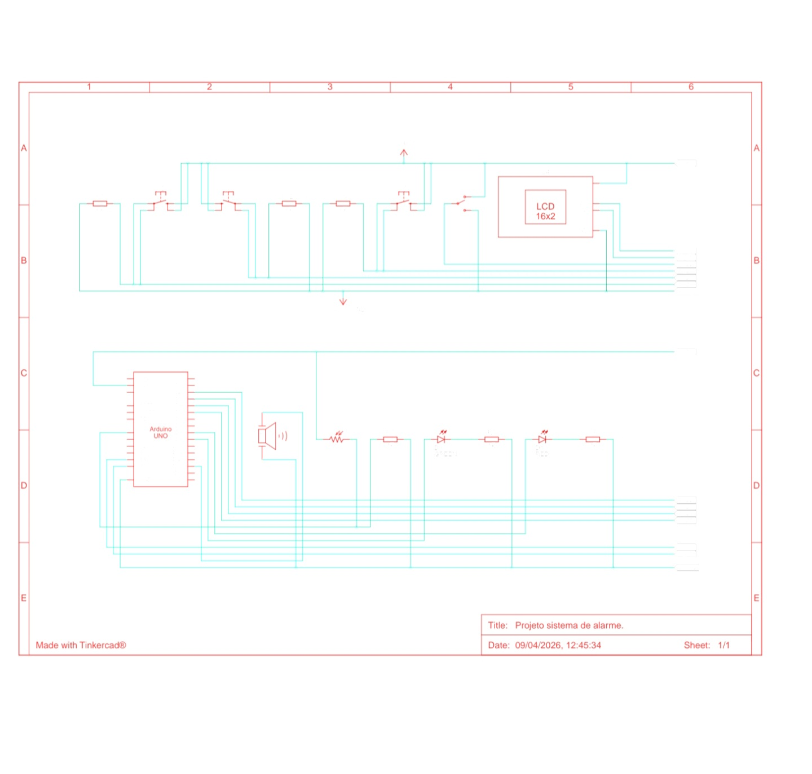

# 🚨 Sistema de Alarme Noturno IoT

Projeto de um sistema de alarme residencial utilizando Arduino, com simulação desenvolvida no Tinkercad.

---

## 📌 Descrição

Sistema projetado para detectar movimento durante o período noturno e acionar alertas sonoros e visuais.

---

## 🎯 Objetivo

* Detectar movimento com sensor PIR
* Acionar alarme sonoro
* Indicar status com LED
* Apresenta em tela LCD

---

## ▶️ Simulação

Clique no botão abaixo para testar:

💡 Basta clicar em **Executar simulação** para ver o sistema funcionando.

---

## 🧰 Componentes Utilizados

📊 Lista completa: [Ver componentes](data/componentes.csv)

---

## 💻 Código

📁 `src/alarme_noturno.ino`

---

## 🔌 Esquema do Circuito

📄 Versão completa em PDF: [Abrir esquema](docs/Projeto_alarme_noturno.pdf)

---

## ⚙️ Funcionamento

1. Sensor detecta movimento
2. Sistema ativa buzzer
3. LED indica alerta
4. LCD apresenta em tela 

---
## 👨‍💻 Autor

<table width="100%">
  <tr>
    <td align="left">
      <a href="https://github.com/W1ll-Amorim">
         
        <b>Wiliam de Amorim</b>
      </a>
    </td>
    <td align="right">
      <a href="https://github.com/LilNavaHoods">
         
        <b>Lohan da Silva</b>
      </a>
    </td>
  </tr>
</table>
